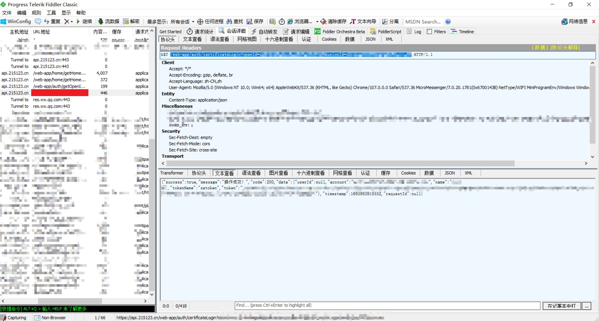

# HuiHuTong
 慧湖通刷闸机的二维码秒开版
 此项目仅支持安卓客户端，ios可以使用[WEB版本](https://github.com/mercutiojohn/hht-web)（纯前端的PWA应用，无密钥泄露风险，可以安装到手机桌面） 
# 使用方法
1. 电脑安装抓包工具，比如fiddler，开始抓包
2. 打开微信PC版，用PC版打开慧湖通小程序并确保已登录
3. 打开完成后，找到请求`https://api.215123.cn/web-app/auth/certificateLogin?openId=xxx&unionId=xxx`，复制URL中的`openId`参数
4. 将`openId`参数填入本项目的软件中
5. 二维码会定时自动刷新（点击二维码可手动刷新）
6. 双指可以缩放二维码大小

# 抓包教程（以Fiddler4为例）
1. 下载并安装Fiddler4（官网： https://www.telerik.com/fiddler ）
2. 启用https抓包（Fiddler4需要手动安装证书才可以启用https抓包）
此步骤图文教程： https://jingyan.baidu.com/article/37bce2be3042e25103f3a26d.html

    1. 打开Fiddler4，点击`Tools`->`Options`，在弹出的窗口中选择`HTTPS`选项卡，勾选`Decrypt HTTPS traffic`，点击`OK`保存设置
    2. 点击`Actions`->`Trust Root Certificate`，弹出的窗口中选择`Yes`，点击`OK`保存设置
    3. 重启Fiddler4开始抓包

3. 打开微信PC版，登录微信

4. 打开慧湖通小程序，点击`我的`，确保已登录
5. 在Fiddler4中找到`https://api.215123.cn/web-app/auth/certificateLogin?openId=xxx&unionId=xxx`，复制URL中的`openId`参数，也就是从`openId=`到`&unionId`之间的内容

